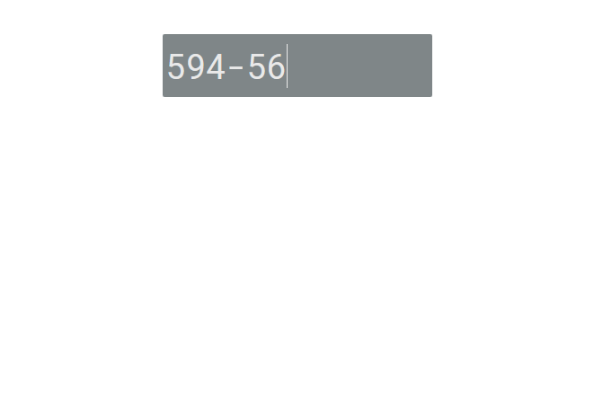
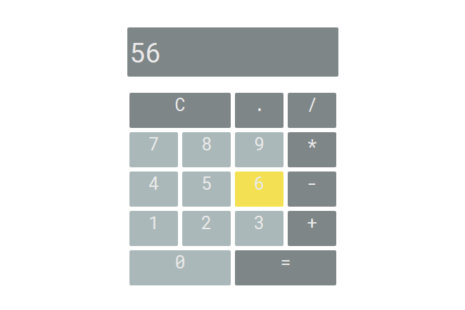

# Calculator
 A simple web calculator made in HTML, CSS and Javascript. 
## General info
Basically you see only input, where you can type some calculations with keyboard.
When hover below input, screen keyboard will appear.

## Screenshots
#### Before hover

#### On hover

## Technologies
* HTML5
* CSS3
* JavaScript

## Preview
You can see live version here:
https://unpolaco.github.io/Calculator/

